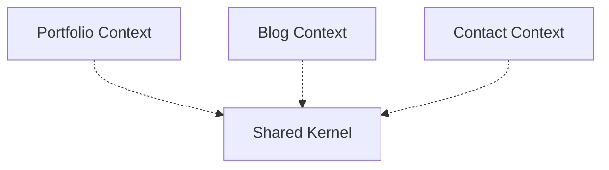

# Task ID: 11

**Title:** Create packages/core architecture documentation

**Status:** pending

**Dependencies:** None

**Priority:** low

**Description:** Document bounded contexts, architectural decisions, layer rules, and ubiquitous language for the domain layer

**Details:**

Create comprehensive documentation for packages/core:

1. `packages/core/ARCHITECTURE.md`:
   - Bounded context map (Portfolio, Blog, Contact, Shared Kernel)
   - Dependency rules between contexts
   - Layer isolation rules (what core can/cannot import)
   - Visual diagram of context boundaries
   - Export structure (@repo/core/portfolio, @repo/core/shared, etc.)

2. `packages/core/GLOSSARY.md`:
   - Ubiquitous Language definitions for Portfolio context:
     - Project, Experience, Profile, Skill
     - Value Objects: Slug, Image, DateRange, LocalizedText, etc.
   - Term definitions with examples
   - Relationships between domain concepts

3. `packages/core/decisions/adr-template.md`:
```markdown
# ADR-XXX: [Title]

## Status
[Proposed | Accepted | Deprecated | Superseded]

## Context
[What is the issue we're facing?]

## Decision
[What did we decide?]

## Consequences
[What becomes easier or harder?]

## Alternatives Considered
[What other options did we evaluate?]
```

4. `packages/core/decisions/ADR-001-repository-interfaces-in-core.md`:
```markdown
# ADR-001: Repository Interfaces Belong in Core, Not Application

## Status
Accepted

## Context
In Clean Architecture, repository interfaces (ports) can be placed in either the domain layer (core) or application layer. We need to decide where they belong in our monorepo.

## Decision
Repository interfaces are defined in `packages/core` alongside their respective entities, not in `packages/application`.

Structure:
- `packages/core/src/portfolio/entities/project/repositories/IProjectRepository.ts`
- `packages/core/src/portfolio/entities/experience/repositories/IExperienceRepository.ts`

## Consequences

**Positive:**
- Interfaces live with their aggregate roots (high cohesion)
- Domain defines its own persistence contract
- Application layer doesn't need to define infrastructure contracts
- Easier to understand what operations are available per entity

**Negative:**
- Some Clean Architecture implementations put interfaces in application
- Requires clear documentation of this architectural choice

## Alternatives Considered

1. **Application Layer Interfaces**: Place in `packages/application/ports/repositories/`
   - Rejected: Separates interface from entity, lower cohesion

2. **Separate Ports Package**: Create `packages/ports`
   - Rejected: Over-engineering for monorepo, adds unnecessary complexity
```

Ensure documentation is referenced from root `CLAUDE.md`.

**Test Strategy:**

Documentation validation:

1. Completeness:
   - ARCHITECTURE.md covers all bounded contexts
   - GLOSSARY.md defines all domain terms
   - ADR-001 follows template structure

2. Accuracy:
   - Visual diagrams match actual code structure
   - Export paths match package.json exports
   - Glossary definitions align with code

3. Formatting:
   - All markdown files render correctly
   - Links between documents work
   - Code blocks have proper syntax highlighting

4. Integration:
   - Reference added to root CLAUDE.md
   - Documentation discoverable by developers

5. Review:
   - Technical accuracy review by team
   - No contradictions with CLAUDE.md guidelines

## Subtasks

### 11.1. Create ARCHITECTURE.md with bounded contexts and dependency rules

**Status:** pending  
**Dependencies:** None  

Document bounded context map (Portfolio, Blog, Contact, Shared Kernel), dependency rules between contexts, layer isolation rules, export structure, and context boundaries

**Details:**

Create `packages/core/ARCHITECTURE.md` with:

1. **Bounded Context Map**: Document all bounded contexts (Portfolio, Blog, Contact, Shared Kernel) with clear boundaries
2. **Dependency Rules**: Explain that contexts cannot import from each other directly, only from Shared Kernel
3. **Layer Isolation Rules**: Document what core can/cannot import (no Prisma, React, Next.js, HTTP clients)
4. **Export Structure**: Document public exports (@repo/core/portfolio, @repo/core/blog, @repo/core/shared)
5. **Visual Diagram**: Use Mermaid or ASCII art to show context boundaries and relationships
6. **Reference from root CLAUDE.md**: Ensure it mentions this ARCHITECTURE.md file

Follow existing Portfolio context structure from packages/core/src/portfolio/index.ts as reference.

### 11.2. Create visual diagrams for context boundaries and package structure

**Status:** pending  
**Dependencies:** 11.1  

Design and implement visual diagrams showing bounded context relationships, package dependencies, and architectural layers using Mermaid syntax

**Details:**

Add Mermaid diagrams to ARCHITECTURE.md:

1. **Bounded Context Diagram**: Show Portfolio, Blog, Contact contexts with Shared Kernel in the center
2. **Package Dependency Graph**: Visualize core ← application ← infra ← web/api dependency flow
3. **Context Exports Diagram**: Show how @repo/core/portfolio, @repo/core/blog, @repo/core/shared exports are organized

Example Mermaid syntax:


Ensure diagrams match actual code structure and export patterns.

### 11.3. Create GLOSSARY.md with ubiquitous language definitions

**Status:** pending  
**Dependencies:** 11.1  

Document comprehensive ubiquitous language for Portfolio context including all entities and value objects with examples and relationships

**Details:**

Create `packages/core/GLOSSARY.md` with structured definitions:

**Entities:**
- **Project**: A portfolio work item (commercial, personal, or academic)
- **Experience**: A professional work experience entry
- **Profile**: The portfolio owner's personal data
- **Skill**: A technical or professional capability

**Value Objects (from Shared Kernel):**
- **Slug**: URL-friendly identifier (kebab-case, min 3 chars)
- **Image**: Represents visual asset with URL, alt text, dimensions
- **DateRange**: Period with start/end dates and ongoing flag
- **LocalizedText**: Multi-language text content (pt-BR, en-US)
- **Markdown**: Rich text content in markdown format
- **Tag**: Categorization label
- **Technology**: Tech stack item with name and category

Include:
- Definition for each term
- TypeScript type signature examples
- Usage examples from actual entities
- Relationships between concepts (e.g., Project contains Skills, uses Slug)

### 11.4. Create ADR template in decisions/ directory

**Status:** pending  
**Dependencies:** None  

Establish ADR template structure for documenting future architectural decisions

**Details:**

Create `packages/core/decisions/adr-template.md`:

```markdown
# ADR-XXX: [Title]

## Status
[Proposed | Accepted | Deprecated | Superseded]

## Context
[What is the issue we're facing? What constraints exist? What are the requirements?]

## Decision
[What did we decide? Be specific and actionable.]

## Consequences

**Positive:**
- [What becomes easier or better?]

**Negative:**
- [What becomes harder or requires trade-offs?]

## Alternatives Considered

1. **[Alternative Name]**:
   - Description: [What was this option?]
   - Rejected because: [Why didn't we choose this?]

2. **[Alternative Name]**:
   - Description: [What was this option?]
   - Rejected because: [Why didn't we choose this?]
```

Create decisions/ directory if it doesn't exist.

### 11.5. Write ADR-001 for repository interface placement decision

**Status:** pending  
**Dependencies:** 11.4  

Document architectural decision to place repository interfaces in core layer alongside entities rather than in application layer

**Details:**

Create `packages/core/decisions/ADR-001-repository-interfaces-in-core.md`:

**Status**: Accepted

**Context**: Explain that Clean Architecture allows repository interfaces (ports) in either domain or application layer. We needed to decide placement for monorepo.

**Decision**: Repository interfaces defined in `packages/core` alongside entities:
- `packages/core/src/portfolio/entities/project/repositories/IProjectRepository.ts`
- `packages/core/src/portfolio/entities/experience/repositories/IExperienceRepository.ts`
- Pattern: interfaces live with their aggregate roots

**Consequences**:
- **Positive**: High cohesion (interface + entity together), domain defines persistence contract, easier discoverability
- **Negative**: Differs from some Clean Architecture implementations, requires documentation

**Alternatives Considered**:
1. **Application Layer Interfaces** (`packages/application/ports/repositories/`): Rejected due to lower cohesion
2. **Separate Ports Package** (`packages/ports`): Rejected as over-engineering for monorepo

Reference actual repository interfaces from packages/core/src/portfolio.

### 11.6. Integrate documentation into root CLAUDE.md and validate completeness

**Status:** pending  
**Dependencies:** 11.1, 11.2, 11.4, 11.5  

Add references to new core documentation in root CLAUDE.md and perform final validation of all documentation deliverables

**Details:**

1. **Update root CLAUDE.md**:
   - Add reference to `packages/core/ARCHITECTURE.md` in the DDD section
   - Add reference to `packages/core/GLOSSARY.md` in the DDD — Domain-Driven Design section
   - Add reference to `packages/core/decisions/` directory in relevant sections
   - Example: "See `packages/core/ARCHITECTURE.md` for detailed bounded context map and layer rules"

2. **Validation Checklist**:
   - [ ] ARCHITECTURE.md exists and covers all 4 bounded contexts
   - [ ] Visual diagrams render correctly (Mermaid syntax)
   - [ ] GLOSSARY.md defines all entities and VOs
   - [ ] adr-template.md follows industry standard
   - [ ] ADR-001 is complete with alternatives analysis
   - [ ] All files referenced from root CLAUDE.md
   - [ ] No broken internal links
   - [ ] Consistent terminology across all docs

3. **Cross-reference verification**:
   - Ensure export paths in ARCHITECTURE.md match packages/core/src/portfolio/index.ts
   - Verify entity names in GLOSSARY.md match actual class names in codebase
   - Check that ADR-001 references real file paths
