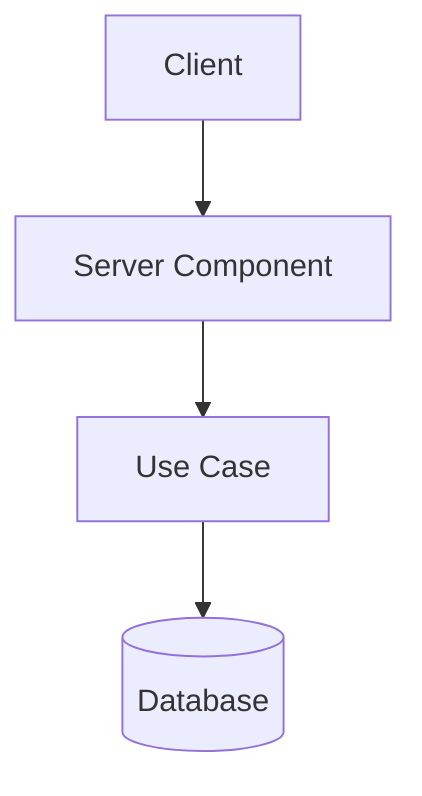

# 12 — Design System

> `@repo/ui` — shared React component library used across `apps/site` and `apps/admin`.

---

## Overview

`@repo/ui` is a `'use client'`-ready component library built with React and Tailwind CSS. It is bundled by **tsup** and organized into three namespaces:

| Namespace | Import path | Components |
|-----------|-------------|------------|
| **Control** | `@repo/ui/Control` | Accordion, Button, Input, Label, Modal, Radio, RadioGroup, TextArea, Text, ToggleGroup |
| **Imagery** | `@repo/ui/Imagery` | Icon |
| **View** | `@repo/ui/View` | Badge, Divider, SectionHeader, TextRich |

---

## Usage

```typescript
import { Button } from '@repo/ui/Control';
import { Icon } from '@repo/ui/Imagery';
import { Badge, TextRich } from '@repo/ui/View';
```

Components with hooks (e.g. `TextRich`, `Modal`, interactive controls) are safe to use inside `'use client'` boundaries. Server Components may import them; the `'use client'` directive propagates correctly.

---

## Control

### Accordion

Collapsible section with `Root`, `Header`, and `Body` sub-components.

```tsx
<Accordion.Root>
  <Accordion.Header>Title</Accordion.Header>
  <Accordion.Body>Content</Accordion.Body>
</Accordion.Root>
```

### Button

Multiple variants via sub-components:

| Sub-component | Purpose |
|---------------|---------|
| `Button.Base` | Standard action button |
| `Button.Link` | Styled link (`next/link`) |
| `Button.Clipboard` | Copy-to-clipboard with feedback |
| `Button.Toggle` | Single toggle (pressed state) |
| `Button.ToggleGroup` | Grouped exclusive toggles |

### Input / TextArea / Label

Standard form controls. Use with React Hook Form `register`.

### Modal

Dialog overlay. Renders into a portal; use within a `'use client'` component.

### RadioGroup / Radio

Accessible radio selection. Composed as `RadioGroup` + `Radio` children.

---

## Imagery

### Icon

Renders an icon by name using the project's icon library.

```tsx
<Icon icon="github" className="text-xl" />
```

---

## View

### Badge

Inline tag with optional icon or count. Three variants:

| Sub-component | Usage |
|---------------|-------|
| `Badge.Text` | Label only |
| `Badge.WithIcon` | Label + icon |
| `Badge.Count` | Numeric count (e.g. `+3`) |

### Divider

Full-width horizontal rule. Accepts `className` for spacing overrides.

### SectionHeader

Page/section heading with optional overline and description. Accepts an `as` prop for semantic heading level (`h1`–`h6`).

```tsx
<SectionHeader
  overline="Projects"
  title="My Work"
  description="A selection of things I've built."
  as="h2"
  align="center"
/>
```

### TextRich

Renders rich Markdown content with full GitHub-Flavored Markdown support and **Mermaid diagram rendering**.

```tsx
<TextRich content={markdownString} className="prose" />
```

**Mermaid support:** code blocks tagged ` ```mermaid ` are rendered as SVG diagrams on the client side. Uses `React.lazy` + `Suspense` to isolate the Mermaid runtime into a separate bundle chunk — the main `View/index.mjs` stays hook-free and is safe to import from Server Component context.

```markdown

```

Plugins enabled:
- `remark-gfm` — tables, strikethrough, task lists
- `rehype-raw` — raw HTML in Markdown
- `rehype-sanitize` — XSS protection

---

## Bundle structure

tsup produces one chunk per namespace plus a lazy chunk for Mermaid:

```text
dist/
  Control/index.mjs    → interactive form/control components
  Imagery/index.mjs    → Icon
  View/index.mjs       → Badge, Divider, SectionHeader, TextRich (no hooks at module level)
  MermaidBlock-*.mjs   → lazy chunk; only loaded when a mermaid block is rendered
```

---

## Adding a new component

1. Create `src/<Namespace>/<ComponentName>/index.tsx` (one component per file)
2. Export from `src/<Namespace>/index.ts`
3. If the component uses React hooks, add `'use client'` at the top of the component file
4. **Never** use hooks at module level in the namespace `index.ts` barrel — this keeps the bundle compatible with Server Component imports
5. Add tests in `packages/ui/src/<Namespace>/<ComponentName>/`; tests are mandatory for new components

---

## See Also

- **[02-ARCHITECTURE](./02-ARCHITECTURE.md)** — `'use client'` boundary rules
- **[08-TESTING](./08-TESTING.md)** — Component testing strategy
- **[ROADMAP](./ROADMAP.md)** — Design system sprint history
