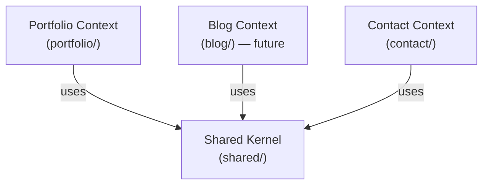
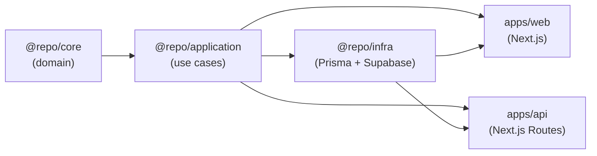

# packages/core — Architecture

This document describes the bounded contexts, dependency rules, layer isolation constraints, and public export structure of `packages/core`.

---

## Bounded Contexts

`packages/core` is organized into four bounded contexts plus a Shared Kernel:



| Context | Path | Status | Responsibility |
|---|---|---|---|
| **Portfolio** | `src/portfolio/` | Active | Projects, experiences, profile, skills |
| **Blog** | `src/blog/` | Stub (future) | Posts, tags, categories |
| **Contact** | `src/contact/` | Stub | Contact messages |
| **Shared Kernel** | `src/shared/` | Active | Base classes, VOs, errors, Either pattern |

### Rules Between Contexts

- Contexts **do not import from each other** directly.
- Only the **Shared Kernel** (`src/shared/`) is shared across all contexts.
- Cross-context communication happens via **Domain Events** (Observer pattern), never direct imports.

---

## Package Dependency Graph

Dependencies point **inward only**. `packages/core` sits at the center:



### Layer Isolation Rules

`packages/core` **must never import**:

| Forbidden | Reason |
|---|---|
| `prisma`, `@prisma/client` | Infrastructure concern |
| `next`, `next/*` | Presentation concern |
| `react`, `react-dom` | Presentation concern |
| `axios`, `node-fetch` | HTTP client — infrastructure concern |
| Any `@repo/application`, `@repo/infra` | Would invert dependency direction |

---

## Portfolio Context — Internal Structure

```
src/portfolio/
  entities/
    experience/
      model/
        Experience.ts         → Aggregate root
        ExperienceSkill.ts    → Value Object (skill + workDescription)
      repositories/
        IExperienceRepository.ts
      index.ts
    language/
      model/
        Language.ts
      index.ts
    professional-value/
      model/
        ProfessionalValue.ts
      index.ts
    profile/
      model/
        Profile.ts            → Aggregate root
        ProfileStat.ts        → Value Object
      repositories/
        IProfileRepository.ts
      index.ts
    project/
      model/
        Project.ts            → Aggregate root
        ProjectStatus.ts      → Enum VO
      repositories/
        IProjectRepository.ts
      index.ts
    skill/
      model/
        Skill.ts              → Entity
      factory/
        SkillFactory.ts       → Bulk factory
      repositories/
        ISkillRepository.ts
      index.ts
    social-network/
      model/
        SocialNetwork.ts
      index.ts
  index.ts                    → Re-exports all entities and interfaces
```

---

## Shared Kernel — Internal Structure

```
src/shared/
  base/
    Entity.ts           → Abstract base class for entities
    ValueObject.ts      → Abstract base class for VOs
  either.ts             → Either<L, R> pattern (Left, Right, left(), right())
  errors/
    DomainError.ts      → Abstract base error class
    ValidationError.ts  → For invariant violations
    NotFoundError.ts    → For lookup failures
  i18n/
    Locale.ts           → Supported locale enum (pt-BR, en-US)
    LocalizedText.ts    → Multi-language text VO
  types/
    index.ts            → Shared TypeScript utility types
  vo/
    DateRange.ts        → Period with start/end and isActive()
    DateTime.ts         → Parsed date/time wrapper
    EmploymentType.ts   → full-time | part-time | freelance | internship
    Fluency.ts          → Language proficiency levels
    Id.ts               → UUID identifier VO
    Image.ts            → URL + localized alt text
    LocationType.ts     → on-site | remote | hybrid
    Name.ts             → Person/entity name VO
    SkillType.ts        → hard | soft | language
    Slug.ts             → Kebab-case URL identifier
    Text.ts             → Generic text with length constraints
    Url.ts              → Validated URL VO
```

---

## Public Export Structure

Consumers should prefer **subpath imports** to avoid pulling in unnecessary code:

```typescript
// ✅ Preferred — subpath imports
import { Project, IProjectRepository } from '@repo/core/portfolio';
import { Slug, Either, ValidationError } from '@repo/core/shared';

// ✅ Also valid — full package (re-exports all)
import { Project, Slug } from '@repo/core';

// ❌ Never — direct file path imports
import { Project } from '@repo/core/src/portfolio/entities/project/model/Project';
```

| Subpath | Entry point | Content |
|---|---|---|
| `@repo/core` | `src/index.ts` | Everything (shared + portfolio + blog + contact) |
| `@repo/core/shared` | `src/shared/index.ts` | Base classes, VOs, errors, Either, i18n |
| `@repo/core/portfolio` | `src/portfolio/index.ts` | Entities, VOs, repository interfaces |
| `@repo/core/blog` | `src/blog/index.ts` | Stub (future) |
| `@repo/core/contact` | `src/contact/index.ts` | Stub |

---

## Architectural Decisions

See [`decisions/`](./decisions/) for ADRs documenting key architectural choices:

- [ADR-001 — Repository interfaces belong in core, not application](./decisions/ADR-001-repository-interfaces-in-core.md)
